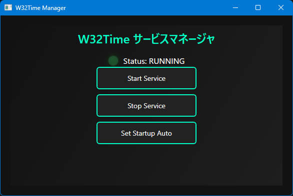

# TT-W32TimeManager

W32Time（Windows Time サービス）を制御・監視するためのツールです。  
C# / WPF で開発されており、GUIからサービスの開始・停止、時刻の同期が可能です。

## 🧩 主な機能

- 設備用(基板分割機で使用)W32Timeサービスの状態確認  
- サービスの開始・停止  

## 💻 動作環境

- Windows 10 / 11  
- .NET 6.0 またはそれ以降  

## 📦 ビルド方法

Visual Studio でソリューションファイルを開き、ビルドしてください。  
必要な NuGet パッケージは自動的に復元されます。

## アプリ画面

## 📝 License

This project is licensed under the MIT License.  
See the [LICENSE](LICENSE) file for details.
