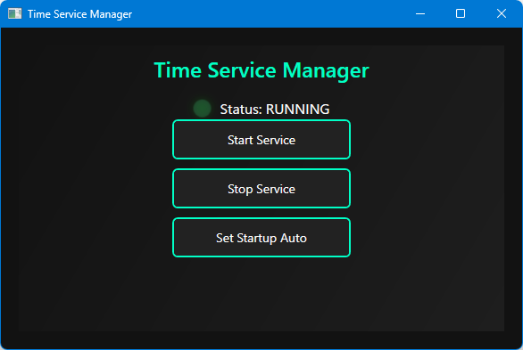

# TT-W32TimeManager

W32Time（Windows Time サービス）を制御・監視するためのツールです。  
C# / WPF で開発されており、GUIからサービスの開始・停止、時刻の同期が可能です。

## 🧩 主な機能

- W32Timeサービスの状態確認  
- サービスの開始・停止  

## 💻 動作環境

- Windows 10 / 11  
- .NET 6.0 またはそれ以降  

## 📦 ビルド方法

Visual Studio でソリューションファイルを開き、ビルドしてください。  
必要な NuGet パッケージは自動的に復元されます。

## アプリ画面

## 📝 License

This project is licensed under the MIT License.  
See the [LICENSE](LICENSE) file for details.

## 👨‍💻 作者

**TA Li-Wang-Tom**

- GitHub: [@Li-Wang-Tom](https://github.com/Li-Wang-Tom)

## 🙏 謝辞

このプロジェクトの開発にあたり、以下の技術とコミュニティに感謝いたします。

**技術基盤:**

- **Microsoft .NET** - 開発プラットフォーム
- **WPF (Windows Presentation Foundation)** - デスクトップUI
- **Windows Services** - サービス基盤

**開発環境:**

- **Visual Studio** - 優秀な統合開発環境
- **GitHub** - コード管理とコラボレーション
- **NuGet** - パッケージ管理システム

**コミュニティ:**

- **Microsoft Docs** - 技術文書
- **.NET Community** - オープンソースエコシステム

感谢以下技术和社区为本项目开发提供的支持：

**核心技术:**

- **Microsoft .NET** - 强大的开发平台
- **WPF** - 优秀的桌面应用界面框架
- **Windows Services** - 稳定的系统服务架构

**开发工具:**

- **Visual Studio** - 功能强大的集成开发环境
- **GitHub** - 代码版本控制与团队协作平台
- **NuGet** - 便捷的包管理解决方案

**技术社区:**

- **Microsoft Docs** - 详尽的官方技术文档
- **.NET Community** - 活跃的开源开发者社区

向所有为开源技术发展做出贡献的开发者们致敬！
谢谢大家！🎉
